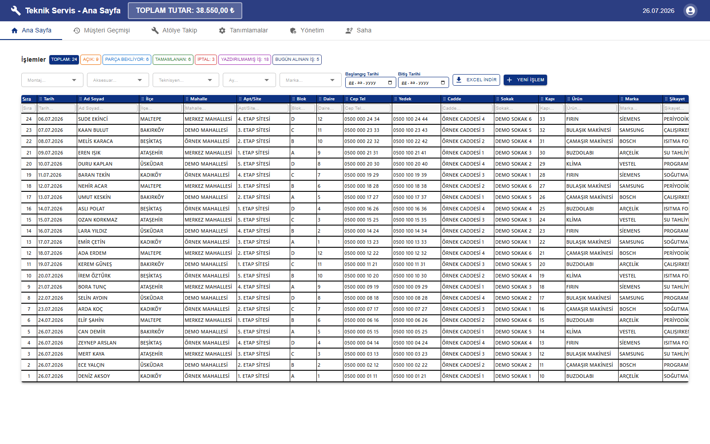
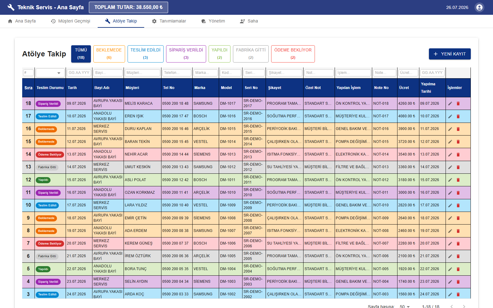
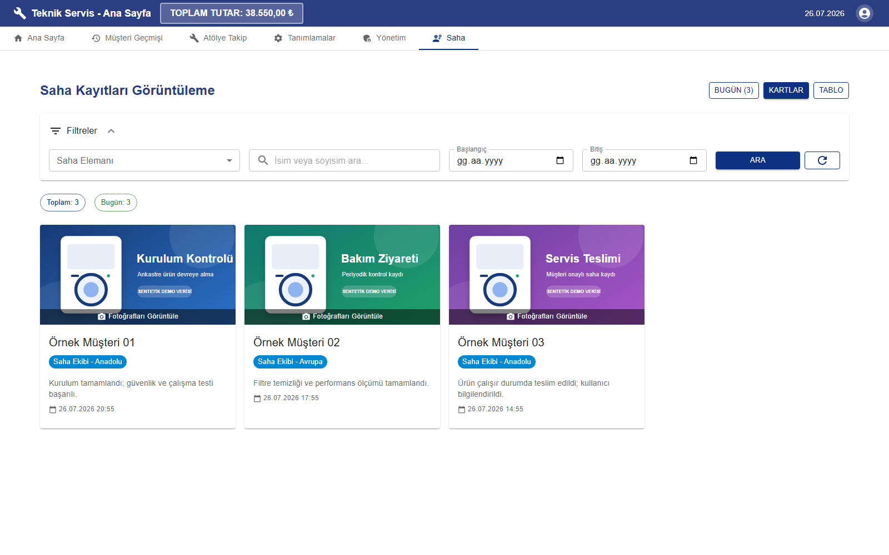
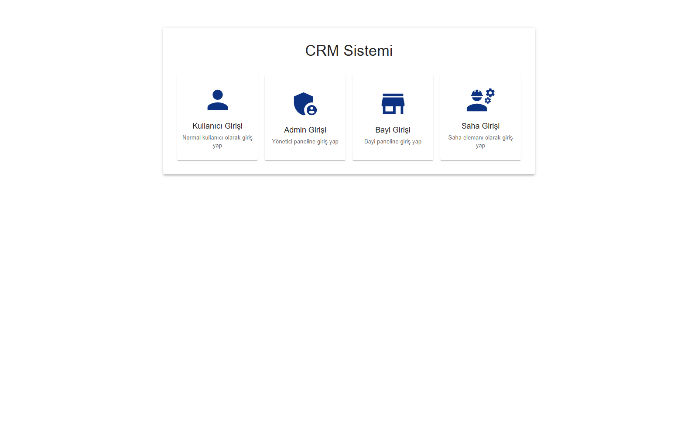
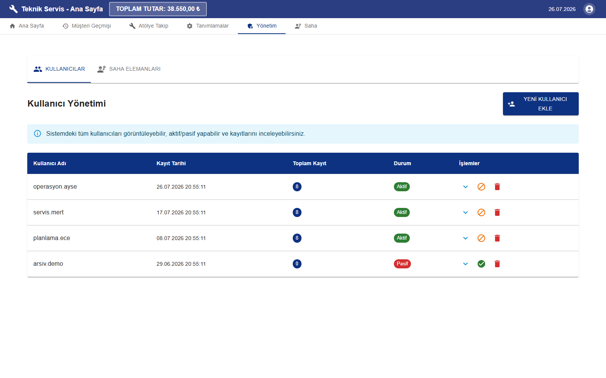
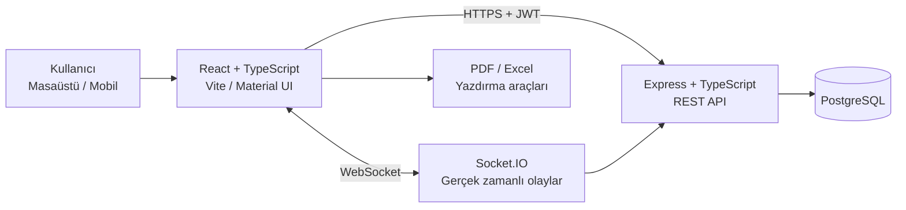

<div align="center">

# ProjeCRM

### Teknik servis, atölye ve saha operasyonları için gerçek zamanlı CRM platformu

Müşteri kabulünden teknisyen yönlendirmesine, atölye durum takibinden saha kayıtlarına kadar servis operasyonunun tamamını tek merkezde yöneten, rol tabanlı ve mobil uyumlu bir uygulama.

[](https://github.com/salih12s/projecrm/actions/workflows/ci.yml)
[](https://www.typescriptlang.org/)
[](https://react.dev/)
[](https://nodejs.org/)
[](https://www.postgresql.org/)
[](https://socket.io/)
[](https://github.com/salih12s/projecrm)
[](LICENSE)

</div>

---

## İçindekiler

- [Proje hakkında](#proje-hakkında)
- [Ekran görüntüleri](#ekran-görüntüleri)
- [Temel yetenekler](#temel-yetenekler)
- [Kullanıcı rolleri](#kullanıcı-rolleri)
- [Mimari](#mimari)
- [Teknoloji yığını](#teknoloji-yığını)
- [Proje yapısı](#proje-yapısı)
- [Yerel kurulum](#yerel-kurulum)
- [Ortam değişkenleri](#ortam-değişkenleri)
- [Komutlar](#komutlar)
- [API ve gerçek zamanlı olaylar](#api-ve-gerçek-zamanlı-olaylar)
- [Kalite kontrolleri](#kalite-kontrolleri)
- [Güvenlik ve veri gizliliği](#güvenlik-ve-veri-gizliliği)
- [Production dağıtımı](#production-dağıtımı)
- [Sorun giderme](#sorun-giderme)
- [Teknik dokümantasyon](#teknik-dokümantasyon)
- [Yol haritası](#yol-haritası)
- [Lisans](#lisans)

## Proje hakkında

ProjeCRM, teknik servis işletmelerinin günlük operasyonlarını dağınık tablolar ve bağımsız araçlar yerine tek bir uygulamada yönetmesi için geliştirilmiştir. Uygulama; servis kaydı oluşturma, müşteri geçmişini inceleme, atölyeye alınan ürünleri durum bazlı takip etme, saha ekiplerinin fotoğraflı kayıtlarını yönetme, kullanıcı yetkilendirme, yazdırma ve raporlama süreçlerini bir araya getirir.

Sistem özellikle aşağıdaki operasyonel ihtiyaçlara odaklanır:

- Yoğun servis kayıtlarında hızlı arama, filtreleme ve sayfalama
- Telefon numarasına göre mükerrer müşteri ve geçmiş kayıt kontrolü
- Servis, atölye ve saha ekipleri arasında güncel veri paylaşımı
- Açık, parça bekleyen, tamamlanan ve iptal edilen işlerin anlık takibi
- Bayi, standart kullanıcı, yönetici ve saha personeli için farklı arayüzler
- Excel, PDF ve özelleştirilebilir servis formu çıktıları
- Masaüstü ve mobil cihazlarda kullanılabilir operasyon ekranları

## Ekran görüntüleri

> [!NOTE]
> Aşağıdaki ekranların tamamı yalnızca localhost üzerinde çalışan, bu dokümantasyon için oluşturulmuş izole bir PostgreSQL veritabanından alınmıştır. Görünen isimler, telefonlar, adresler, kullanıcılar, tutarlar ve saha görselleri tamamen sentetik demo verileridir. Canlı veritabanı veya gerçek müşteri verisi kullanılmamıştır.

### Servis operasyon panosu



Durum sayaçları, gelişmiş filtreler, kolon bazlı arama, tarih aralığı, Excel aktarımı ve yeni servis kaydı işlemleri aynı ekranda sunulur.

### Atölye ve saha operasyonları

<table>
  <tr>
    <td width="50%">
      
    </td>
    <td width="50%">
      
    </td>
  </tr>
  <tr>
    <td align="center"><strong>Durum bazlı atölye takibi</strong></td>
    <td align="center"><strong>Fotoğraflı saha kayıtları</strong></td>
  </tr>
</table>

### Rol ve kullanıcı yönetimi

<table>
  <tr>
    <td width="50%">
      
    </td>
    <td width="50%">
      
    </td>
  </tr>
  <tr>
    <td align="center"><strong>Dört farklı giriş deneyimi</strong></td>
    <td align="center"><strong>Merkezi kullanıcı yönetimi</strong></td>
  </tr>
</table>

## Temel yetenekler

### Servis kaydı yönetimi

- Müşteri, adres, iletişim, ürün, marka ve şikâyet bilgilerinin tek formda yönetimi
- Açık, parça bekliyor, tamamlandı ve iptal durumları
- Telefon ve ad üzerinden müşteri geçmişi arama
- Mükerrer kayıt tespiti ve mevcut kayıt uyarısı
- Karaliste telefon/adres kontrolü
- Kayıt klonlama, düzenleme, silme ve durum değiştirme
- Beklemeye alınan formları daha sonra sürdürme
- Kolon bazlı, tarih bazlı ve tanım bazlı gelişmiş filtreleme
- Sunucu taraflı sayfalama ve büyük veri kümeleri için kademeli gösterim

### Atölye takibi

- Bayi, müşteri, telefon, marka, model, seri ve not bilgileri
- `Beklemede`, `Teslim Edildi`, `Sipariş Verildi`, `Yapıldı`, `Fabrika Gitti` ve `Ödeme Bekliyor` akışları
- Durumlara göre renk kodlu satırlar ve anlık sayaçlar
- İşlem, ücret, not numarası ve tamamlanma tarihi takibi
- Filtreleme, sayfalama ve gerçek zamanlı güncelleme

### Saha operasyonları

- Saha personeline özel giriş ve çalışma ekranı
- Bir kayda birden fazla fotoğraf ekleyebilme
- Fotoğraf önizleme, galeri ve kayıt detayları
- Yönetici tarafında kart ve tablo görünümü
- Personel, isim, tarih aralığı ve gün bazlı filtreler
- Saha personeli aktif/pasif durumu ve kayıt performansı

### Tanımlar ve çıktı araçları

- Teknisyen, marka, ürün, bayi, montaj ve aksesuar tanımları
- Marka bazlı yazdırma ayarları
- Sürükle-bırak destekli yazdırma şablonu düzenleme
- PDF servis formu üretimi
- Excel dışa aktarımı
- Türkçe karakter uyumlu gömülü fontlar

### Gerçek zamanlı çalışma

Socket.IO bağlantısı sayesinde yeni servis/atölye kaydı, güncelleme, silme ve durum değişiklikleri açık oturumlara anlık olarak iletilir. Kullanıcıların sayfayı manuel yenilemeden güncel operasyon verisini görmesi hedeflenir.

## Kullanıcı rolleri

| Yetki alanı                      |   Admin    | Standart kullanıcı |    Bayi     | Saha personeli |
| -------------------------------- | :--------: | :----------------: | :---------: | :------------: |
| Servis kayıtları                 | Tam erişim | Operasyon erişimi  |      —      |       —        |
| Müşteri geçmişi                  |     ✓      |         ✓          |      —      |       —        |
| Atölye takibi                    |     ✓      |         ✓          | Odak ekranı |       —        |
| Tanım yönetimi                   |     ✓      |         —          |      —      |       —        |
| Kullanıcı yönetimi               |     ✓      |         —          |      —      |       —        |
| Tüm saha kayıtlarını görüntüleme |     ✓      |         ✓          |      —      |       —        |
| Kendi saha kayıtlarını yönetme   |     —      |         —          |      —      |       ✓        |

Arayüz, oturumdaki role göre sekmeleri ve çalışma akışını otomatik olarak düzenler. API istekleri JWT bearer token ile doğrulanır.

## Mimari



### İstek akışı

1. React istemcisi kullanıcı oturumunu ilgili giriş endpoint'i üzerinden açar.
2. API, kimliği doğrular ve 24 saat geçerli JWT üretir.
3. Axios katmanı token'ı korunan isteklere `Authorization: Bearer ...` başlığıyla ekler.
4. Express route katmanı isteği doğrular, PostgreSQL sorgusunu çalıştırır ve sonucu istemciye döndürür.
5. Veri değiştiren işlemler ilgili Socket.IO olayını yayınlar.
6. Aktif istemciler veriyi yeniden yüklemeden arayüz durumunu günceller.

### Veri ve performans yaklaşımı

- PostgreSQL bağlantıları `pg.Pool` ile yönetilir.
- Geçici bağlantı hataları için sınırlı sorgu retry mekanizması vardır.
- Sık kullanılan durum, tarih, teknisyen, telefon ve müşteri alanlarında indeksler bulunur.
- Servis ve atölye listeleri sunucu taraflı sayfalama kullanır.
- Filtre girişleri debounce edilir.
- Ağır ekranlar `React.lazy` ve `Suspense` ile ihtiyaç anında yüklenir.
- Büyük tablolar parça parça render edilir.

## Teknoloji yığını

| Katman             | Teknolojiler                                         |
| ------------------ | ---------------------------------------------------- |
| Frontend           | React 18, TypeScript 5, Vite 5, Material UI 5        |
| State ve istemci   | React Context, custom hooks, Axios                   |
| Gerçek zamanlı     | Socket.IO Client 4, Socket.IO Server 4               |
| Backend            | Node.js 20, Express 4, TypeScript, compression, CORS |
| Veritabanı         | PostgreSQL 15+, `pg` bağlantı havuzu                 |
| Kimlik doğrulama   | JWT, bcryptjs                                        |
| Dosya ve raporlama | pdf-lib, jsPDF, jspdf-autotable, xlsx                |
| Arayüz araçları    | @hello-pangea/dnd, react-window                      |
| Kod kalitesi       | ESLint, Prettier, TypeScript strict kontrolleri      |
| CI                 | GitHub Actions                                       |

## Proje yapısı

```text
projecrm/
├── .github/
│   └── workflows/
│       └── ci.yml                  # Type-check, lint, format ve build pipeline
├── backend/
│   ├── src/
│   │   ├── bootstrap/              # Tablo, lokasyon ve indeks başlangıç işleri
│   │   ├── constants/              # Socket event sabitleri
│   │   ├── middleware/             # JWT, async ve hata middleware'leri
│   │   ├── migrations/             # SQL migration dosyaları
│   │   ├── routes/                 # REST API modülleri
│   │   ├── scripts/                # Admin, seed, dev ve legacy bakım araçları
│   │   ├── types/                  # Backend TypeScript tipleri
│   │   ├── utils/                  # Logger ve ortak yardımcılar
│   │   ├── db.ts                   # PostgreSQL pool ve retry katmanı
│   │   └── server.ts               # Express + Socket.IO başlangıç noktası
│   ├── package.json
│   └── tsconfig.json
├── frontend/
│   ├── public/
│   │   ├── fonts/                  # PDF/yazdırma fontları
│   │   └── templates/              # Servis formu şablonları
│   ├── src/
│   │   ├── components/
│   │   │   ├── admin/              # Kullanıcı ve saha personeli yönetimi
│   │   │   ├── atolye/             # Atölye takip ekranları
│   │   │   ├── auth/               # Rol bazlı giriş
│   │   │   ├── dashboard/          # Ana operasyon panosu
│   │   │   ├── islem/              # Servis formu, filtre ve tablo
│   │   │   ├── musteri/            # Müşteri geçmişi
│   │   │   ├── saha/               # Saha kayıtları ve fotoğraf galerisi
│   │   │   └── settings/           # Tanımlar ve yazdırma editörü
│   │   ├── constants/              # Rol, durum ve event sabitleri
│   │   ├── context/                # Auth ve snackbar context'leri
│   │   ├── hooks/                  # Pagination, filtre ve socket hook'ları
│   │   ├── services/               # Modül bazlı API servisleri
│   │   ├── types/                  # Frontend TypeScript tipleri
│   │   └── utils/                  # Format, Excel ve print yardımcıları
│   ├── package.json
│   └── vite.config.ts
├── docs/
│   ├── screenshots/                # README ekran görüntüleri
│   └── refactor/                   # Mimari ve refactor raporları
├── LICENSE
├── package.json                    # Monorepo komutları
└── README.md
```

## Yerel kurulum

### Ön koşullar

- Node.js `20.x` veya üzeri
- npm `10.x` veya üzeri
- PostgreSQL `15` veya üzeri
- Git

### 1. Repoyu klonlayın

```bash
git clone https://github.com/salih12s/projecrm.git
cd projecrm
```

### 2. Bağımlılıkları yükleyin

```bash
npm run install:all
```

Bu komut kök, backend ve frontend bağımlılıklarını sırasıyla yükler.

### 3. Ortam dosyalarını oluşturun

macOS/Linux:

```bash
cp backend/.env.example backend/.env
cp frontend/.env.example frontend/.env.development
```

PowerShell:

```powershell
Copy-Item backend/.env.example backend/.env
Copy-Item frontend/.env.example frontend/.env.development
```

> [!IMPORTANT]
> Backend geliştirme sırasında doğrudan `backend/.env` dosyasını yükler. Bu dosyanın `DB_HOST=127.0.0.1` veya `DB_HOST=localhost` kullandığını çalıştırmadan önce mutlaka doğrulayın. Uygulama başlangıçta tablo, kolon ve indeks kontrolleri yaptığı için yanlışlıkla production veritabanına yönlendirilmiş bir geliştirme süreci şema değişikliği oluşturabilir.

### 4. Yerel veritabanını oluşturun

Önerilen yöntem, proje için ayrı bir yerel veritabanı kullanmaktır:

```sql
CREATE DATABASE projecrm;
```

Ardından `backend/.env` içinde bağlantıyı yapılandırın:

```dotenv
DB_HOST=127.0.0.1
DB_PORT=5432
DB_NAME=projecrm
DB_USER=postgres
DB_PASSWORD=yerel_postgresql_parolaniz
```

Backend ilk çalıştırmada operasyon tablolarını, gerekli kolonları, lokasyon verilerini ve performans indekslerini kontrol eder. Eksik yapılar otomatik oluşturulur.

### 5. Uygulamayı başlatın

```bash
npm run dev
```

| Servis      | Adres                   |
| ----------- | ----------------------- |
| Frontend    | `http://localhost:5173` |
| Backend API | `http://localhost:5000` |
| Socket.IO   | `http://localhost:5000` |

Frontend ve backend'i ayrı terminallerde çalıştırmak isterseniz:

```bash
npm run dev:backend
npm run dev:frontend
```

### 6. İlk yerel standart kullanıcıyı oluşturun

Backend çalışırken yalnızca yerel ortamınızda:

```bash
curl -X POST http://localhost:5000/api/auth/register \
  -H "Content-Type: application/json" \
  -d '{"username":"local.user","password":"guclu-bir-yerel-parola"}'
```

Yönetici hesabı ayrı `admins` tablosunda tutulur. Yönetici yardımcıları `backend/src/scripts/admin/` altındadır; bunları çalıştırmadan önce hedef veritabanını ve script içindeki varsayılan değerleri mutlaka gözden geçirin.

## Ortam değişkenleri

### Backend

| Değişken                   |     Gerekli     | Açıklama                         | Yerel örnek               |
| -------------------------- | :-------------: | -------------------------------- | ------------------------- |
| `PORT`                     |      Hayır      | API portu                        | `5000`                    |
| `NODE_ENV`                 |      Evet       | Çalışma modu                     | `development`             |
| `DB_HOST`                  |     Yerelde     | PostgreSQL sunucusu              | `127.0.0.1`               |
| `DB_PORT`                  |     Yerelde     | PostgreSQL portu                 | `5432`                    |
| `DB_NAME`                  |     Yerelde     | Veritabanı adı                   | `projecrm`                |
| `DB_USER`                  |     Yerelde     | Veritabanı kullanıcısı           | `postgres`                |
| `DB_PASSWORD`              |     Yerelde     | Veritabanı parolası              | —                         |
| `DATABASE_URL`             |   Production    | Tek parça PostgreSQL bağlantısı  | —                         |
| `JWT_SECRET`               |      Evet       | JWT imzalama anahtarı            | Güçlü ve rastgele değer   |
| `SYSTEM_PASSWORD_HASH`     | Kullanıma bağlı | Sistem parolasının bcrypt hash'i | —                         |
| `FRONTEND_URL`             |   Production    | CORS allow-list ek origin'i      | `https://app.example.com` |
| `DEBUG_DB_POOL`            |      Hayır      | Pool bağlantı logları            | `false`                   |
| `DB_POOL_MAX`              |      Hayır      | Production pool üst sınırı       | `10`                      |
| `DB_IDLE_TIMEOUT_MS`       |      Hayır      | Boş bağlantı zaman aşımı         | `60000`                   |
| `DB_CONNECTION_TIMEOUT_MS` |      Hayır      | Bağlantı kurma zaman aşımı       | `15000`                   |

Rastgele JWT secret üretmek için:

```bash
node -e "console.log(require('crypto').randomBytes(48).toString('hex'))"
```

### Frontend

| Değişken       | Gerekli | Açıklama            | Yerel örnek                 |
| -------------- | :-----: | ------------------- | --------------------------- |
| `VITE_API_URL` |  Evet   | REST API kök adresi | `http://localhost:5000/api` |

Örnek `frontend/.env.development`:

```dotenv
VITE_API_URL=http://localhost:5000/api
```

## Komutlar

### Kök komutlar

| Komut                  | Açıklama                                               |
| ---------------------- | ------------------------------------------------------ |
| `npm run dev`          | Backend ve frontend'i birlikte başlatır                |
| `npm run dev:backend`  | Yalnızca Express/Socket.IO sunucusunu başlatır         |
| `npm run dev:frontend` | Yalnızca Vite geliştirme sunucusunu başlatır           |
| `npm run install:all`  | Tüm workspace bağımlılıklarını yükler                  |
| `npm run build`        | Backend TypeScript ve frontend production build üretir |
| `npm run lint`         | Tüm repo için ESLint çalıştırır                        |
| `npm run lint:fix`     | Otomatik düzeltilebilir lint sorunlarını düzeltir      |
| `npm run format`       | Desteklenen dosyaları Prettier ile biçimlendirir       |
| `npm run format:check` | Biçim farklarını dosya değiştirmeden kontrol eder      |

### Paket bazlı komutlar

```bash
# Backend
cd backend
npm run dev
npm run build
npm run start

# Frontend
cd frontend
npm run dev
npm run build
npm run preview
```

## API ve gerçek zamanlı olaylar

### REST API modülleri

| Kök endpoint             | Sorumluluk                                                         |
| ------------------------ | ------------------------------------------------------------------ |
| `/api/auth`              | Standart kullanıcı/bayi girişi, kayıt ve sistem parolası doğrulama |
| `/api/admin`             | Admin girişi, kullanıcılar ve kullanıcı kayıtları                  |
| `/api/islemler`          | Servis kayıtları, arama, istatistik ve durum yönetimi              |
| `/api/atolye`            | Atölye CRUD, sayfalama ve durum sayaçları                          |
| `/api/saha`              | Saha girişleri, personel ve fotoğraflı kayıtlar                    |
| `/api/karaliste`         | Telefon/adres kontrolü ve karaliste yönetimi                       |
| `/api/locations/ilceler` | İlçe ve mahalle verileri                                           |
| `/api/teknisyenler`      | Teknisyen tanımları                                                |
| `/api/markalar`          | Marka tanımları                                                    |
| `/api/urunler`           | Ürün tanımları                                                     |
| `/api/bayiler`           | Bayi tanımları                                                     |
| `/api/montajlar`         | Montaj tanımları                                                   |
| `/api/aksesuarlar`       | Aksesuar tanımları                                                 |
| `/api/printer-settings`  | Marka bazlı yazdırma ayarları                                      |

Auth ve lokasyon girişleri dışındaki operasyon endpoint'leri JWT doğrulaması kullanır.

### Socket.IO olayları

| Olay                  | Kullanım                  |
| --------------------- | ------------------------- |
| `yeni-islem`          | Yeni servis kaydı         |
| `islem-guncellendi`   | Servis kaydı güncellemesi |
| `islem-silindi`       | Servis kaydı silinmesi    |
| `islem-durum-degisti` | İş durumu değişikliği     |
| `yeni-atolye`         | Yeni atölye kaydı         |
| `atolye-guncellendi`  | Atölye kaydı güncellemesi |
| `atolye-silindi`      | Atölye kaydı silinmesi    |

Event isimleri frontend ve backend'de ayrı sabit dosyalarında aynı sözleşmeyle tutulur:

- `backend/src/constants/socketEvents.ts`
- `frontend/src/constants/socketEvents.ts`

## Kalite kontrolleri

Yerel doğrulama:

```bash
# Backend type-check
npx tsc -p backend/tsconfig.json --noEmit

# Frontend type-check
npx tsc -p frontend/tsconfig.json --noEmit

# Kod kalitesi
npm run lint
npm run format:check

# Production build
npm run build
```

GitHub Actions pipeline şu adımları Node.js 20 üzerinde çalıştırır:

1. Kök, backend ve frontend bağımlılıklarının temiz kurulumu
2. Backend TypeScript type-check
3. Frontend TypeScript type-check
4. ESLint kontrolü
5. Prettier format kontrolü
6. Frontend production build
7. Backend TypeScript build

> [!NOTE]
> Mevcut CI yapılandırmasında type-check ve build adımları zorunlu; lint ve format kontrolleri bilgilendirici çalışır (`continue-on-error`). Yeni katkılarda tüm kontrollerin yerelde hatasız tamamlanması önerilir.

## Güvenlik ve veri gizliliği

- API oturumları süreli JWT bearer token kullanır.
- Admin, standart kullanıcı ve saha hesabı parola akışlarında bcrypt hash doğrulaması bulunur.
- Korumalı route'lar merkezi auth middleware üzerinden doğrulanır.
- Production bağlantılarında PostgreSQL SSL yapılandırması desteklenir.
- CORS origin listesi backend tarafında sınırlandırılır.
- `.env`, `.env.development`, `.env.local` ve `.env.production` dosyaları Git dışında tutulur.
- Log katmanı production ortamında hassas hata ayrıntılarını sınırlar.
- README görsellerinde canlı veya yerel gerçek kullanıcı verisi bulunmaz.

> [!CAUTION]
> `.env.production` veya production `DATABASE_URL` kullanarak migration, seed, bakım ya da geliştirme komutu çalıştırmayın. Önce `DB_HOST`, `DB_NAME`, `NODE_ENV` ve varsa `DATABASE_URL` değerlerini doğrulayın. Özellikle `backend/src/scripts/migrations-legacy/` altındaki araçlar tek seferlik bakım amacı taşır.

Production'a açmadan önce ayrıca HTTPS reverse proxy, rate limit, Helmet, secret rotation, yedekleme ve rol bazlı endpoint yetki denetimi uygulanması önerilir.

## Production dağıtımı

### Build

```bash
npm ci
cd backend && npm ci
cd ../frontend && npm ci
cd ..
npm run build
```

Build çıktıları:

| Paket    | Çıktı            |
| -------- | ---------------- |
| Backend  | `backend/dist/`  |
| Frontend | `frontend/dist/` |

### Backend production değişkenleri

Asgari olarak:

```dotenv
NODE_ENV=production
PORT=5000
DATABASE_URL=postgresql://...
JWT_SECRET=...
FRONTEND_URL=https://uygulama.example.com
```

### Dağıtım kontrol listesi

- [ ] Production veritabanı yedeği alındı
- [ ] Ortam değişkenleri platform secret yönetiminde tanımlandı
- [ ] `JWT_SECRET` güçlü ve ortama özel
- [ ] HTTPS ve reverse proxy aktif
- [ ] Frontend origin'i CORS listesinde
- [ ] Backend ve frontend build kontrolleri başarılı
- [ ] Veritabanı migration etkisi önceden incelendi
- [ ] Login, servis kaydı, atölye ve Socket.IO smoke testleri tamamlandı
- [ ] Log ve hata izleme sistemi doğrulandı

## Sorun giderme

### Backend veritabanına bağlanamıyor

1. PostgreSQL servisinin çalıştığını kontrol edin.
2. `backend/.env` içindeki host, port, veritabanı, kullanıcı ve parolayı doğrulayın.
3. Geliştirme ortamında `DATABASE_URL` tanımlıysa kaldırın; bu değer ayrı DB alanlarının önüne geçer.
4. Hedef veritabanının kullanıcı tarafından erişilebilir olduğunu kontrol edin.

### Frontend API istekleri CORS hatası veriyor

- Uygulamayı varsayılan olarak `http://localhost:5173` üzerinden açın.
- `VITE_API_URL=http://localhost:5000/api` değerini doğrulayın.
- Farklı bir origin kullanıyorsanız backend `allowedOrigins` listesine ekleyin.

### Girişten sonra tekrar login ekranına dönüyor

- API'nin çalıştığını ve frontend'in doğru endpoint'e bağlandığını kontrol edin.
- Tarayıcıdaki eski `token` ve `user` localStorage değerlerini temizleyin.
- `JWT_SECRET` değerinin backend yeniden başlatmaları arasında değişmediğini doğrulayın.

### Lokasyon listeleri boş

İlk başlangıçta lokasyon bootstrap işleminin tamamlanmasını bekleyin. Gerekirse:

```bash
cd backend
npm run fetch-locations
```

Bu komutu yalnızca doğrulanmış yerel veritabanı bağlantısıyla çalıştırın.

### Port kullanımda

Varsayılan portlar:

- Backend: `5000`
- Frontend: `5173`

Portu kullanan süreci kapatın veya ilgili ortam değişkeni/Vite argümanı ile farklı port seçin.

## Teknik dokümantasyon

| Doküman                                                                    | İçerik                             |
| -------------------------------------------------------------------------- | ---------------------------------- |
| [QUICK_START.md](QUICK_START.md)                                           | Kısa kurulum özeti                 |
| [REFACTOR_RAPORU.md](REFACTOR_RAPORU.md)                                   | Refactor sonuçları ve ölçümler     |
| [docs/BASELINE.md](docs/BASELINE.md)                                       | Başlangıç kalite ve yapı envanteri |
| [docs/REFACTOR_PLAYBOOK.md](docs/REFACTOR_PLAYBOOK.md)                     | Tekrarlanabilir refactor yaklaşımı |
| [docs/refactor/api-contract.md](docs/refactor/api-contract.md)             | API sözleşmesi                     |
| [docs/refactor/env-security-audit.md](docs/refactor/env-security-audit.md) | Ortam ve secret güvenliği denetimi |
| [docs/refactor/security-backlog.md](docs/refactor/security-backlog.md)     | Güvenlik iyileştirme listesi       |
| [frontend/src/hooks/README.md](frontend/src/hooks/README.md)               | Frontend hook rehberi              |
| [backend/src/scripts/README.md](backend/src/scripts/README.md)             | Bakım ve script kullanım kuralları |

## Yol haritası

- [ ] OpenAPI/Swagger API dokümantasyonu
- [ ] Vitest, React Testing Library ve Supertest test altyapısı
- [ ] Role özel endpoint yetki politikasının merkezileştirilmesi
- [ ] Helmet ve rate limiting
- [ ] Versiyonlu migration runner
- [ ] Docker Compose ile tekrarlanabilir yerel ortam
- [ ] PostgreSQL yedekleme/geri yükleme runbook'u
- [ ] Gözlemlenebilirlik: merkezi log, metrik ve hata izleme
- [ ] PWA ve çevrimdışı saha deneyimi
- [ ] Türkçe/İngilizce i18n desteği

## Katkı

1. Repoyu fork edin.
2. Açıklayıcı isimli bir branch oluşturun.
3. Küçük ve odaklı commit'ler hazırlayın.
4. Type-check, lint, format ve build kontrollerini çalıştırın.
5. Davranış değişikliği varsa ilgili dokümantasyonu güncelleyin.
6. Pull request içinde değişikliği, doğrulama adımlarını ve olası migration etkisini açıklayın.

## Lisans

Bu proje [MIT Lisansı](LICENSE) ile lisanslanmıştır.

Copyright © 2024–2026 [Salih Saydam](https://github.com/salih12s)

---

<div align="center">
  <strong>ProjeCRM</strong><br>
  Teknik servis operasyonlarını daha görünür, hızlı ve yönetilebilir hale getirmek için geliştirildi.
</div>
