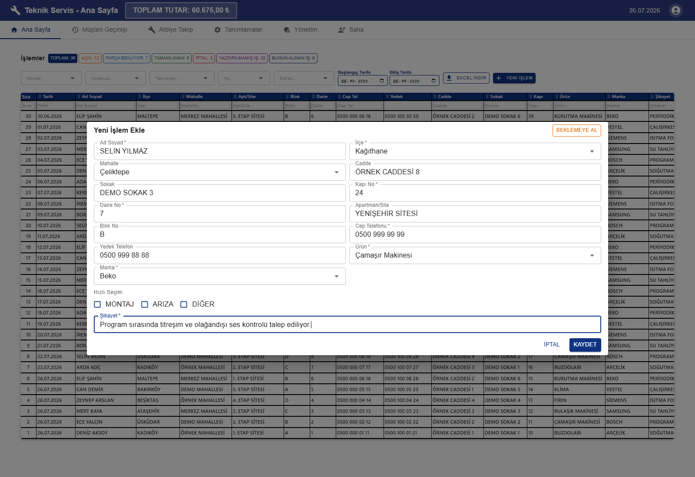
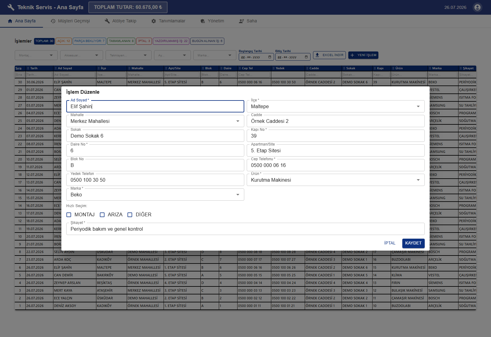
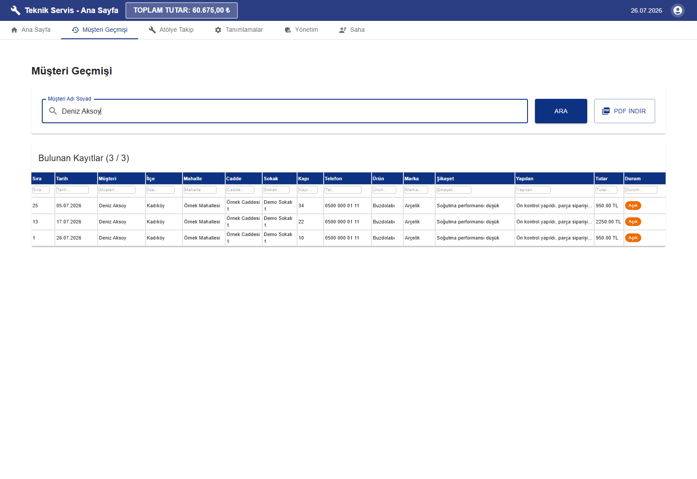
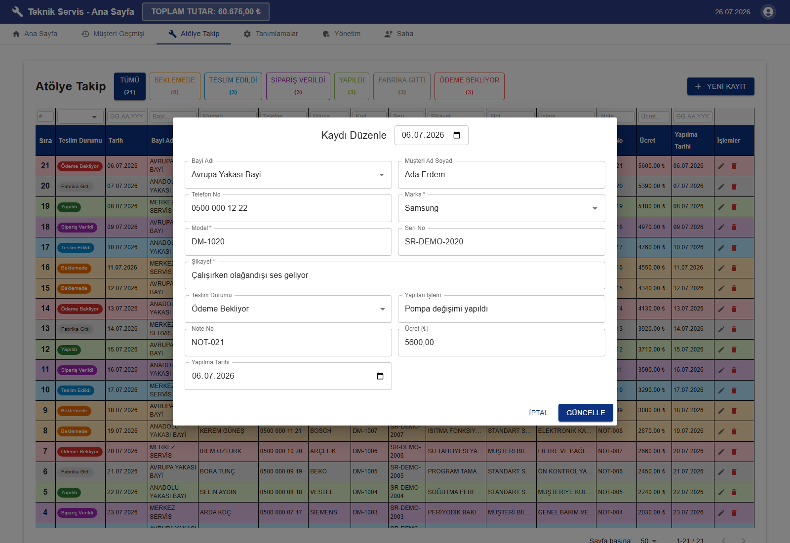
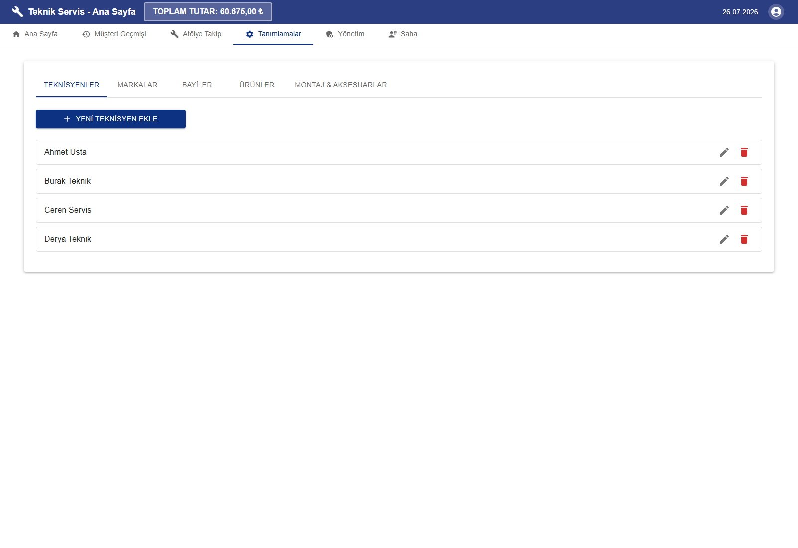
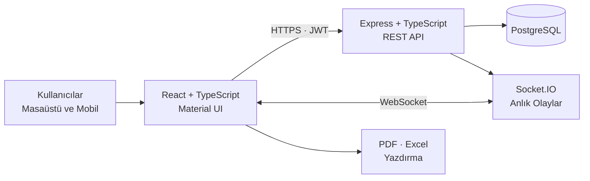

# ProjeCRM

### Teknik servis, atölye ve saha operasyonlarını tek merkezde buluşturan CRM platformu

Müşteri kabulünden servis kaydına, atölye sürecinden saha ekiplerine ve yönetsel raporlamaya kadar tüm operasyonu gerçek zamanlı, rol tabanlı ve izlenebilir bir yapıda yönetir.

---

## Proje özeti

ProjeCRM, teknik servis işletmelerinde farklı tablolar, mesajlaşma kanalları ve fiziksel formlar arasında dağılan iş akışını tek uygulamada toplamak için geliştirildi. Sistem; müşteri ve cihaz bilgilerinin kaydedilmesini, servis sürecinin durum bazlı izlenmesini, atölye ve saha ekiplerinin koordine edilmesini ve operasyon verisinin raporlanmasını sağlar.

Uygulamanın odaklandığı temel iş problemleri:

- Yoğun servis kayıtları içinde hızlı arama, filtreleme ve durum takibi
- Aynı müşterinin geçmiş işlemlerine tek noktadan erişim
- Servis, atölye, bayi ve saha ekipleri arasında güncel bilgi paylaşımı
- Açık, parça bekleyen, tamamlanan ve iptal edilen işlerin görünür hâle gelmesi
- Kullanıcı rolüne göre sadeleştirilmiş ekran ve yetki yapısı
- Operasyon verisinin PDF, Excel ve özelleştirilebilir servis formuna dönüştürülmesi

> [!IMPORTANT]
> Bu README’deki tüm ekranlar yalnızca dokümantasyon için oluşturulmuş, izole bir yerel PostgreSQL veritabanından alınmıştır. Görünen adlar, telefonlar, adresler, kullanıcılar, tutarlar ve kayıtlar tamamen sentetik örnek verilerdir. Canlı veritabanına bağlanılmamış ve gerçek müşteri verisi kullanılmamıştır.

## Ürün deneyimi

### Servis operasyon panosu

Ana operasyon ekranı; durum sayaçlarını, tarih ve tanım filtrelerini, kolon bazlı aramayı, kayıt listesini ve işlem araçlarını aynı görünümde bir araya getirir. Ekipler açık işleri, parça bekleyen kayıtları ve tamamlanan operasyonları tek bakışta takip edebilir.

### Yeni servis kaydı

Yeni işlem akışında müşteri, adres, iletişim, cihaz, marka ve şikâyet bilgileri tek formda yönetilir. Telefon sorgusuyla başlayan akış, mevcut müşteri kontrolünü ve yeni kaydın gerekli alanlarını aynı süreçte ele alır.

### Servis işlem detayı

Mevcut kayıtlar aynı ayrıntı düzeyinde görüntülenebilir; teknisyen, yapılan işlem, ücret ve operasyon durumu güncellenebilir. Böylece müşteri kabulünde oluşan kayıt, iş tamamlanana kadar bağlamını kaybetmeden ilerler.

### Müşteri geçmişi

Müşteri geçmişi görünümü, aynı kişiye ait önceki servis kayıtlarını kronolojik olarak bir araya getirir. Ürün, marka, şikâyet, yapılan işlem, tutar ve güncel durum bilgileri karşılaştırılabilir; sonuçlar PDF çıktısına dönüştürülebilir.

### Atölye operasyonu

Atölyeye alınan cihazlar; bayi, müşteri, marka, model, seri numarası, ücret, işlem ve teslim durumu üzerinden takip edilir. Renk kodlu durumlar ve özet sayaçları, bekleyen ve tamamlanan işlerin hızla ayrıştırılmasını sağlar.

### Atölye kayıt detayı

Kayıt detayında cihazın kabul bilgileri, teknik notları, işlem sonucu, mali verileri ve teslim süreci birlikte yönetilir. Böylece cihazın atölyedeki yaşam döngüsü tek kayıt üzerinden izlenebilir.

### Tanımlar ve operasyon sözlüğü

Teknisyen, ürün, marka, bayi, montaj türü ve aksesuar gibi tekrar kullanılan operasyon verileri merkezi tanım ekranlarından yönetilir. Bu yaklaşım veri girişini hızlandırırken kayıtlar arasındaki isim ve kategori tutarlılığını korur.

### Saha ve yönetim ekranları

<table>
  <tr>
    <td width="50%">
      
    </td>
    <td width="50%">
      
    </td>
  </tr>
  <tr>
    <td align="center"><strong>Fotoğraflı saha kayıtları</strong></td>
    <td align="center"><strong>Kullanıcı ve aktivite yönetimi</strong></td>
  </tr>
</table>

Saha personeli yaptığı çalışmaları birden fazla fotoğraf ve açıklamayla kayıt altına alabilir. Yönetim ekranı ise kullanıcıların aktiflik durumunu, oluşturdukları servis ve atölye kayıtlarını ve saha personeli hesaplarını merkezi olarak gösterir.

### Rol bazlı giriş deneyimi

Yönetici, standart kullanıcı, bayi ve saha personeli için ayrı giriş akışları bulunur. Oturum açıldıktan sonra navigasyon ve erişilebilir modüller kullanıcının rolüne göre otomatik biçimlenir.

## Fonksiyonel kapsam

### Servis yönetimi

- Müşteri, adres, telefon, ürün, marka ve şikâyet bilgilerinin birlikte yönetimi
- Açık, parça bekliyor, tamamlandı ve iptal edildi durum akışları
- Telefon ve ad üzerinden geçmiş kayıt sorgulama
- Mükerrer müşteri, telefon ve adres kontrolleri
- Beklemeye alınan formu daha sonra sürdürme
- Kayıt düzenleme, klonlama, durum değiştirme ve yazdırma
- Tarih aralığı, teknisyen, marka, montaj ve aksesuar filtreleri
- Her kolon için bağımsız arama ve sıralama

### Atölye yönetimi

- Bayi, müşteri, iletişim, marka, model ve seri numarası takibi
- Teknik işlem, not numarası, ücret ve tamamlanma tarihi yönetimi
- Beklemede, teslim edildi, sipariş verildi, yapıldı, fabrikaya gitti ve ödeme bekliyor durumları
- Durumlara göre renk kodlu satırlar ve anlık özet sayaçları
- Filtrelenebilir, sayfalanabilir ve gerçek zamanlı güncellenen kayıt listesi

### Saha operasyonları

- Saha personeline özel, mobil kullanıma uygun çalışma alanı
- Bir iş kaydına birden fazla fotoğraf ekleme
- Fotoğraf önizleme, galeri ve kayıt ayrıntıları
- Personel ve tarih bazlı saha performansı görünümü
- Kart ve tablo arasında değiştirilebilen yönetici ekranı

### Raporlama ve çıktı

- Filtrelenmiş operasyon listesini Excel’e aktarma
- Müşteri geçmişi ve servis formlarını PDF olarak üretme
- Marka bazlı yazdırma ayarları
- Sürükle-bırak destekli servis formu şablon düzenleyicisi
- Türkçe karakterleri koruyan gömülü PDF fontları

## Kullanıcı rolleri

| Yetki alanı                    |  Yönetici  | Standart kullanıcı |    Bayi     | Saha personeli |
| ------------------------------ | :--------: | :----------------: | :---------: | :------------: |
| Servis operasyonları           | Tam erişim | Operasyon erişimi  |      —      |       —        |
| Müşteri geçmişi                |     ✓      |         ✓          |      —      |       —        |
| Atölye takibi                  |     ✓      |         ✓          | Odak ekranı |       —        |
| Merkezi tanımlar               |     ✓      |         —          |      —      |       —        |
| Kullanıcı yönetimi             |     ✓      |         —          |      —      |       —        |
| Tüm saha kayıtlarını inceleme  |     ✓      |         ✓          |      —      |       —        |
| Kendi saha kayıtlarını yönetme |     —      |         —          |      —      |       ✓        |

Rol ayrımı yalnızca arayüz görünümünü değil, kimlik doğrulama akışını ve korunan API işlemlerini de kapsar.

## Sistem mimarisi

Frontend; rol bazlı çalışma alanlarını, veri tablolarını, formları ve çıktı araçlarını sunar. Backend; kimlik doğrulama, iş kuralları, veri erişimi ve gerçek zamanlı olayların merkezidir. PostgreSQL operasyon verisini kalıcı olarak saklarken Socket.IO açık oturumların değişiklikleri sayfa yenilemeden görmesini sağlar.

## Mühendislik yaklaşımı

| Alan                   | Uygulanan yaklaşım                                                                  |
| ---------------------- | ----------------------------------------------------------------------------------- |
| Gerçek zamanlı veri    | Servis ve atölye değişikliklerinin Socket.IO olaylarıyla açık oturumlara iletilmesi |
| Büyük veri kümeleri    | Sunucu taraflı sayfalama, kolon filtreleri ve kademeli tablo gösterimi              |
| Arama deneyimi         | Yoğun filtre girişlerinde debounce kullanımı                                        |
| Veritabanı performansı | Durum, tarih, telefon, teknisyen ve sıralama alanlarında hedefli indeksler          |
| Bağlantı sürekliliği   | PostgreSQL bağlantı havuzu ve geçici sorgu hataları için sınırlı yeniden deneme     |
| Frontend performansı   | Ağır ekranlarda `React.lazy`, `Suspense` ve parçalı yükleme                         |
| Kod güvenilirliği      | Strict TypeScript, ESLint, Prettier ve otomatik kalite kontrolleri                  |
| Doküman üretimi        | PDF, Excel ve özelleştirilebilir yazdırma şablonları                                |

## Teknoloji haritası

| Katman                  | Teknolojiler                                        |
| ----------------------- | --------------------------------------------------- |
| Web arayüzü             | React 18, TypeScript, Vite, Material UI             |
| İstemci veri akışı      | React Context, custom hooks, Axios                  |
| Sunucu                  | Node.js, Express, TypeScript                        |
| Veritabanı              | PostgreSQL, `pg` bağlantı havuzu                    |
| Gerçek zamanlı iletişim | Socket.IO                                           |
| Kimlik doğrulama        | JWT, bcrypt                                         |
| Raporlama               | pdf-lib, jsPDF, jspdf-autotable, xlsx               |
| Arayüz yardımcıları     | react-window, @hello-pangea/dnd                     |
| Kalite altyapısı        | GitHub Actions, ESLint, Prettier, TypeScript strict |

## Güvenlik ve veri yaklaşımı

- Parolalar tek yönlü bcrypt özeti olarak saklanır.
- Korunan istekler JWT tabanlı kimlik doğrulamasından geçer.
- Rol bilgisi hem kullanıcı deneyimini hem de erişilebilir operasyonları belirler.
- Veritabanı sorgularında parametreli SQL kullanılır.
- İzin verilen istemci kaynakları CORS katmanında sınırlandırılır.
- Hassas ortam dosyaları ve üretim çıktıları kaynak kod deposunda tutulmaz.
- README görsellerinde yalnızca sentetik, yerel demo verileri yer alır.

## Projenin öne çıkan yönleri

- Servis, atölye ve saha iş akışlarını tek ürün altında birleştiren uçtan uca kapsam
- Masaüstü yoğun veri tabloları ile mobil saha deneyiminin aynı sistemde sunulması
- Operasyon ekipleri için anlık sayaçlar, renk kodları ve gerçek zamanlı güncellemeler
- Yönetim kararlarını destekleyen kullanıcı aktivitesi, müşteri geçmişi ve çıktı araçları
- Veri hacmi büyüdükçe kullanılabilirliği koruyan sayfalama, indeks ve lazy-loading yaklaşımı
- Gerçek iş akışlarına göre şekillendirilmiş Türkçe arayüz ve doküman çıktıları

## Lisans

Bu proje [MIT Lisansı](LICENSE) ile lisanslanmıştır.

---

**ProjeCRM — teknik servis operasyonunun müşteri kabulünden saha kaydına kadar tek merkezden yönetimi**

